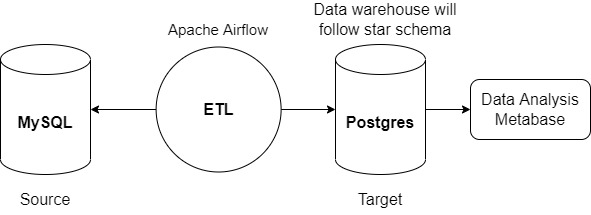
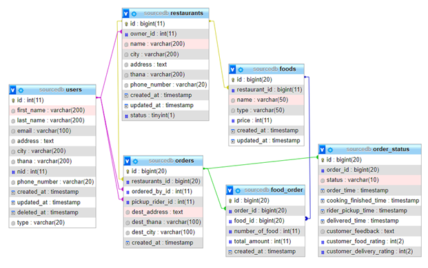
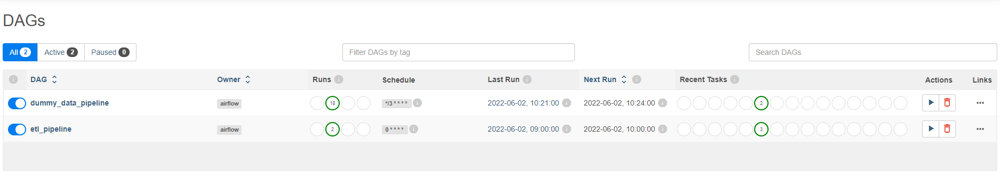
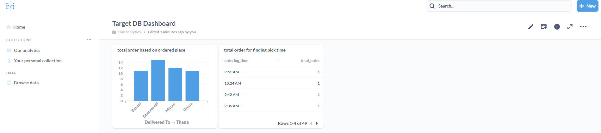

# Design and Develop ETL Framework

## Start The Project
To build dockerimage, run this command: `docker-compose -f "docker-compose.yml" up -d --build`

Or you can build docker image by [VS code docker extention](https://code.visualstudio.com/docs/containers/overview).

All these below informations are in [.env](.env) file.
```
Links of Airflow: http://localhost:8082/
username: airflow
password: airflow

Links of Metabase: http://localhost:9000/ [if the user is not registerd, register yourself]
email: metabase@mail.com
password: metabase123

Link of phpMyadmin: http://localhost:8081/
username: root
password: root_mysql

Link of pgAdmin: http://localhost:8090/
email: test@test.com
password: test
```

## About The Project

The project is about to extract data from different DB and transform that data. The transformed data will be loaded to data warehouse. This ETL (Extract, Transform, Load) task will be done in hourly job. Also, a BI (Buisness Intelligence) analytics tool will be integrated to analysis the data of data warehouse.

Here, I assume, the source DB has the data of online food delivery app. My buisness goals of this small project are:

- Is the delay in delivery hamper the sales?
- Region-based sales analysis.
- Time (monthly/quarter/yearly) based sales analysis.

Following these buisness goals, I design the target DB following Snowflake schema. 
 
## Pipeline

I use [Airflow](https://airflow.apache.org/) to schedule tasks with cron jobs to extract, transform, and load data from a source database to a destination database on an hourly basis. The database in source DB is MySQL, and the database in target DB is Postgres. There is additional Buisness Intelligence Analytics tool [Metabase](https://www.metabase.com/). I dockerize everything including Airflow, Metabase, Postgres, MySQL, pgAdmin, and phpMyAdmin. The diagram is following:

<p align="center">
Figure: Overall ETL Pipeline

</p>


## Database

After building image in docker-compose, you should import the database of source DB and target DB. 

Go to phpMyadmin and import [sourcedb.zip](sql/sourcedb.zip) in `sourcedb` database. 

Go to pgAdmin and open `Query Tool` for targert database. Then, paste the sql from [targetdb.sql](sql/targetdb.sql) in there and run it. It will create the necessary functions and tables.

<p align="center">
Figure: Source DB diagram (MySQL)

</p>

<p align="center">
Figure: Target DB diagram (Postgres) [Data warehouse]

</p>

## Environment and Configuration File
The [.env](.env) file shares the environment variables for [docker-compose.yml](docker-compose.yml) file.

The [config.yaml](airflow/dags/ETL/config.yaml) file shares the configuration to run ETL pipeline. It has the information of file names to store the extracted and transformed data.

## DAGs

<p align="center">
Figure: DAGs

</p>

There are two dags, named `dummy_data_pipeline` and `etl_pipeline`. 

- The `dummy_data_pipeline` is scheduled for every 3 minutes to put an order in source DB. It will help us to test our ETL pipeline. The file is in [data_ingestion](airflow/dags/data_ingestion/) folder.
- The `etl_pipeline` is the ETL pipeline which is scheduled for every 1 hour to do extraction, transformation and loading of data. There is only 3 tasks: [extraction of data from source DB](airflow/dags/ETL/extract.py), [transformation of the extracted data](airflow/dags/ETL/transform.py) amd [loading that transformed data into target DB](airflow/dags/ETL/load.py). I do not use any [XComs](https://airflow.apache.org/docs/apache-airflow/stable/concepts/xcoms) here to cross-comunication of tasks because Xcoms has limitations of memory. So, I put the extracted data in csv and transformed data in json (check the file names in [config.yaml](airflow/dags/ETL/config.yaml)). After completion of all tasks in ETL pipeline, the generated files are removed, so that it does not take any additional memory to store. Also, I use `catchup = False` to start each DAG from latest interval.

## Analysis with Metabase

Here, we use Metabase for analysis of data. You can visit this dashboard for target DB analysis: http://localhost:9000/dashboard/1-target-db-dashboard

I add there two analysis reports (questions) in that dashboard; one is get total order based on region another is getting busy time for order.

<p align="center">
Figure: Metabase Dashboard For Target DB

</p>

You can visit admin dashboard here: http://localhost:9000/admin


## Beyond this project:  Data Governance

However, I do not consider data governance in whole project because the scope of this project is simple. Data governance ensures the data is managed in the organization properly with documented rules. We could consider following steps for considering data governance. 

- Setting and enforcing policies / guidelines for data and metadata
- Know the buisness drivers and relate those to the data
- Defining data context for the application or buisness purpose
- Establihing data accountability for data 
- Establishing metadata management
- Track data lineage 
- Measuring data quality with defined scorecard, metrics
- Follow data security


## Improvement Areas

- Code can be refactored. Like, following Adapter pattern for source or target DB connection.
- Adding partitioning in `fact_order` table of target DB will minimize time for querying.
- Add SSL in airflow and metabase url for security.


